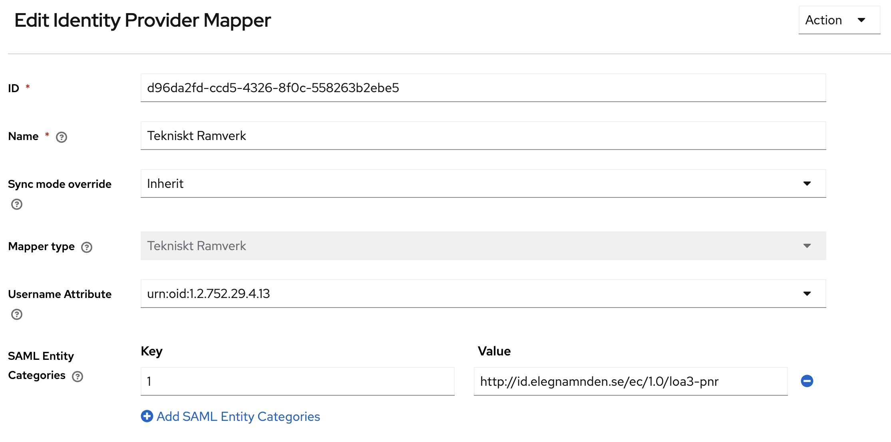
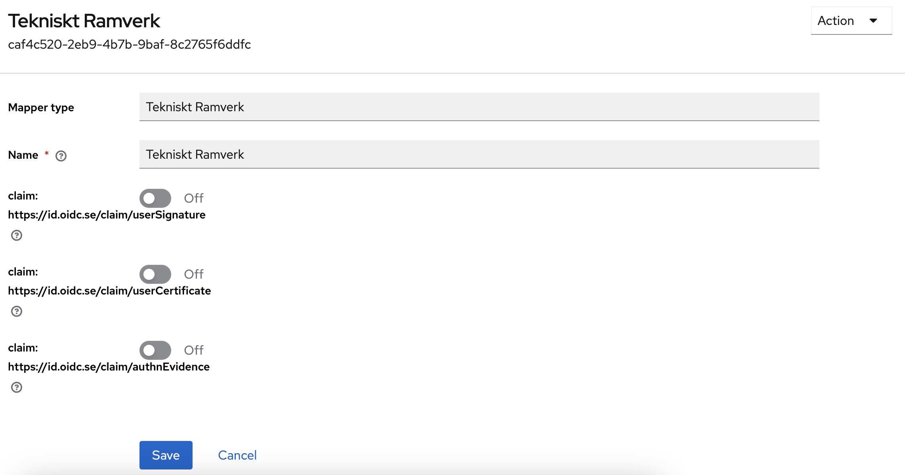

# Keycloak Plugins

Plugins for KeyCloak

## Tekniskt Ramverk

Implements the following

| Module                         | Type                                     | Description                                                                                             |
|--------------------------------|------------------------------------------|---------------------------------------------------------------------------------------------------------|
| OIDCMapper                     | Client Scope                             | Maps Session Notes and User Information from SAML to OIDC                                               |
| TeknisktRamverkAttributeMapper | SAML Attribute Import + Metadata Updater | Saves SAML attributes to the session and modifies keycloak SP metadata to conform with Tekniskt Ramverk |


## Configuration

### SAML

With your IDP, add a new Mapper of type "Tekniskt Ramverk".
Select which SAML attribute should map towards the user's username.
Add Additional Entity Categories that your service provider should expose in its metadata.

**Note** Currently this is done with a key/value mapping however the key is ignored and only needs to be unique.

See example.



### OIDC

Add "Tekniskt Ramverk" as a default scope mapper for a given client.

Additional claims that you might be interested in can be enabled per client by toggling that scope to enabled in the client scope.


## Installation
To install the plugins they need to be built and mounted to `/opt/keycloak/providers/*.jar` in your keycloak instance.

**E.g.**
```bash
    mvn clean install
    cp target/tekniskt.ramverk-<version>.jar <keycloak_contaier_root>/opt/keycloak/providers/tekniskt.ramverk-<version>.jar
```