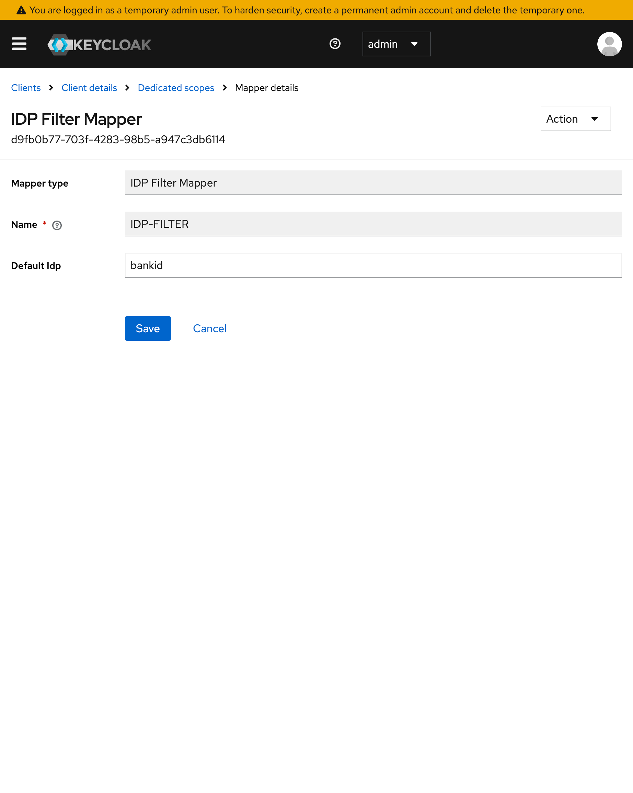

# Keycloak Login Customizer

This module contains plugins to customize identity provider selection.

## Idp Selector
The Idp selector comes in two parts.
The IDPFilterMapper, which allows a client to configure a default identity provider per client instead of per authentication flow.
And the IdpSelectorAuthenticator which reads the client config and automatically forwards the client to its default identity provider.

### Config

