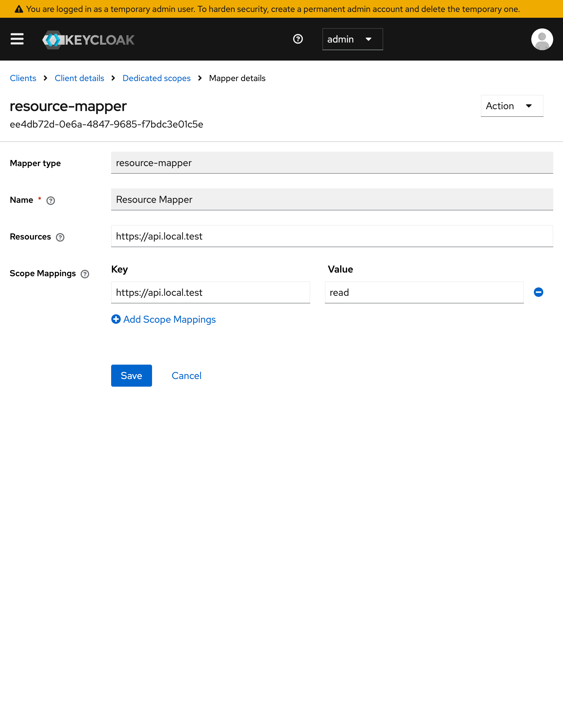
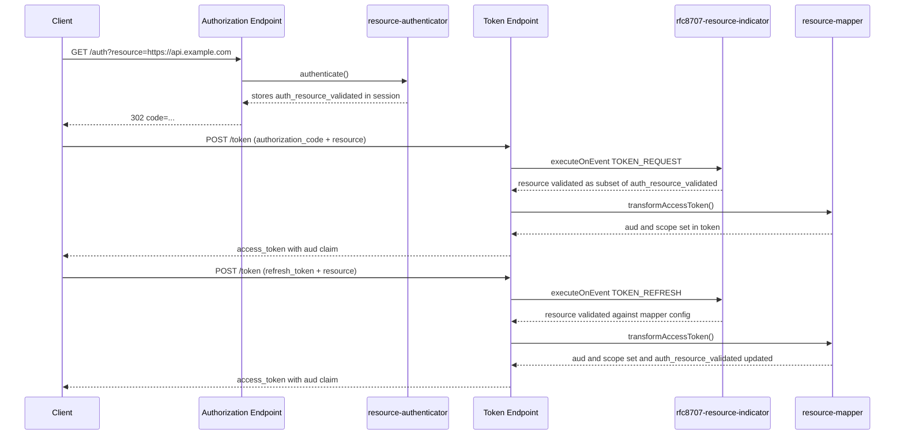

# RFC 8707 Resource Indicators

Support for [RFC 8707 – Resource Indicators for OAuth 2.0](https://www.rfc-editor.org/rfc/rfc8707)
is implemented across three components that must all be configured together:

| Component | Type | Role |
|-----------|------|------|
| `resource-authenticator` | Authentication-flow step | Validates `resource` at the authorization endpoint; stores permitted values in the session |
| `resource-mapper` | Protocol mapper | Reads the validated resource and sets `aud` + down-scoped `scope` on the access token |
| `rfc8707-resource-indicator` | Client policy executor | Validates `resource` at the token endpoint for auth-code exchange and refresh-token grants; returns `invalid_target` on failure |

---

## How it works

### Authorization request

```
GET /auth?response_type=code
         &client_id=my-client
         &resource=https://api.example.com
         &scope=read write
```

1. `resource-authenticator` reads the `resource` parameter from the request.
2. It looks up the client's `resource-mapper` for the list of permitted resource URIs.
3. If the requested resource is not in that list, the auth flow is aborted and the user is
   redirected back with `error=invalid_target`.
4. On success the validated resource URIs are stored in the client-session note
   `auth_resource_validated`.

### Authorization-code exchange

```
POST /token
  grant_type=authorization_code
  &code=...
  &resource=https://api.example.com   ← optional, must be ⊆ auth-request resource
```

1. `rfc8707-resource-indicator` executor fires (event `TOKEN_REQUEST`).
2. If `resource` is present it must be a **subset** of what was stored in `auth_resource_validated`.
   A narrower value is accepted (downscoping at exchange time).
3. On failure the request is rejected immediately with `{"error":"invalid_target"}`.
4. On success the validated resource is stored as a request-scoped session attribute.
5. `resource-mapper` runs during token generation, reads the attribute, and sets:
   - `aud` – the validated resource URI(s)
   - `scope` – intersection of the requested scopes and the per-resource allowed scopes

### Refresh-token grant

```
POST /token
  grant_type=refresh_token
  &refresh_token=...
  &resource=https://api.example.com   ← optional
```

1. `rfc8707-resource-indicator` executor fires (event `TOKEN_REFRESH`).
2. If `resource` is present it is validated against the client's `resource-mapper` config.
3. On failure → `{"error":"invalid_target"}`.
4. On success → stored as session attribute.
5. `resource-mapper` runs, sets `aud` and `scope`, and **persists** the narrowed resource back
   into `auth_resource_validated` so that subsequent refreshes without an explicit `resource`
   parameter retain the narrowed audience.
6. If no `resource` is present in the refresh request, the previously stored
   `auth_resource_validated` value is used unchanged.

---

## Keycloak server requirements

### Duplicate parameter handling

RFC 8707 allows the `resource` parameter to appear multiple times in a single request (one per
resource server). By default Keycloak 26+ rejects any form parameter that appears more than once
with `error=invalid_request, error_description=duplicated parameter`.

`Rfc8707ContainerRequestFilter` is a JAX-RS `@Provider` `ContainerRequestFilter` included in the
provider JAR. It intercepts form-encoded POST requests before Keycloak's duplicate-parameter check
and normalizes the body:

- `resource` — multiple values are collapsed to a single comma-joined value
- all other duplicated parameters — reduced to first value only

`Rfc8707TokenEndpointExecutor` splits the comma-joined value back out before validation, so the
multi-resource semantics are fully preserved end-to-end.

#### Activation

Keycloak 26 discovers `@Provider` classes from provider JARs during the build step:

```bash
# After copying the JAR to /opt/keycloak/providers/
kc.sh build
kc.sh start
```

In **dev mode** (`kc.sh start-dev`) the build step runs automatically at startup — no separate
`kc.sh build` is needed.

No additional configuration is required beyond deploying the JAR.

---

## Configuration

### Step 1 – Add `resource-authenticator` to the authentication flow

1. Open **Realm settings → Authentication**.
2. Duplicate the browser flow (or whichever flow your client uses).
3. Add an execution of type **resource-authenticator**.
4. Set the requirement to **Required**.
5. Bind the modified flow to the client under **Clients → \<client\> → Settings → Authentication flow**.

> The authenticator runs before user interaction and does not produce a UI step. It can be
> placed anywhere in the flow before the token is issued.

### Step 2 – Configure the `resource-mapper` protocol mapper

1. Open **Clients → \<client\> → Client scopes** (or go to a dedicated client scope).
2. Add a mapper of type **resource-mapper**.
3. Set the **Resources** field to a comma-separated list of resource URIs the client is
   allowed to request, e.g.:

   ```
   https://api.example.com,https://other-api.example.com
   ```

4. Optionally configure **Scope Mappings** (a key–value map) to restrict which scopes are
   permitted per resource:

   | Key (resource URI) | Value (space-separated scopes) |
   |--------------------|-------------------------------|
   | `https://api.example.com` | `read write` |
   | `https://other-api.example.com` | `read` |

   Scopes not listed for a resource are stripped from the token when that resource is the
   only requested audience. `openid` is always kept.



### Step 3 – Create a client policy profile with the executor

1. Open **Realm settings → Client policies**.
2. Create a new **profile** (e.g. `rfc8707-profile`).
3. Add an executor of type **rfc8707-resource-indicator**. No additional configuration is required.

### Step 4 – Create a client policy and bind it to the client

1. Still under **Client policies**, create a new **policy** (e.g. `rfc8707-policy`).
2. Add the profile `rfc8707-profile` to this policy.
3. Add a condition of type **client-access-type** (or **client-roles**, or any other condition
   that matches your target client).
4. If you want to target one specific client, use the **client-id** condition and enter the
   client ID.
5. Enable the policy.

---

## Error responses

When validation fails the token endpoint returns a standard OAuth 2.0 error response with
HTTP status `400 Bad Request`:

```json
{
  "error": "invalid_target",
  "error_description": "Requested resource is not permitted for this client"
}
```

Possible `error_description` values:

| Situation | Description |
|-----------|-------------|
| Auth request – resource not in mapper config | `"Client requested a resource indicator but no resource-mapper is configured"` |
| Auth request – URI not in allowed list | `"Client resource request prohibited by policy"` |
| Code exchange – `resource` not subset of auth resource | `"Requested resource was not authorized during the authorization request"` |
| Code exchange – no resource established at auth time | `"Resource indicator not established during the authorization request"` |
| Refresh – URI not in allowed list | `"Requested resource is not permitted for this client"` |
| Refresh – mapper not configured | `"No resource indicators are configured for this client"` |

---

## Down-scoping example

Client requests two resources and two scopes:

```
resource=https://api1.example.com
resource=https://api2.example.com
scope=read write
```

Scope-mapping config on the mapper:

| Resource | Allowed scopes |
|----------|---------------|
| `https://api1.example.com` | `read write` |
| `https://api2.example.com` | `read` |

Result: the access token contains `aud: ["https://api1.example.com","https://api2.example.com"]`
and `scope: "openid read"` — the `write` scope is stripped because it is not permitted for
`https://api2.example.com`.

To obtain `write` the client must issue a separate request that excludes
`https://api2.example.com`:

```
resource=https://api1.example.com
scope=read write
```

---

## Component interaction diagram


