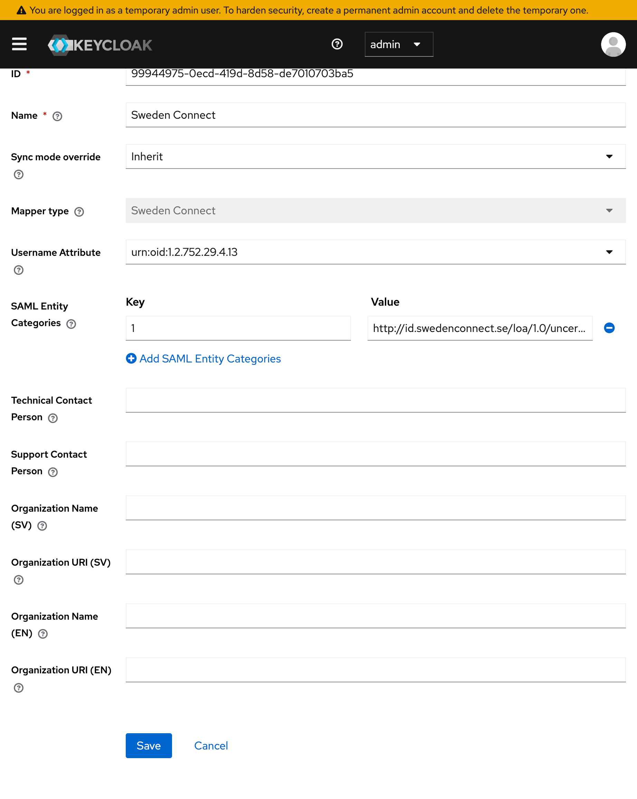
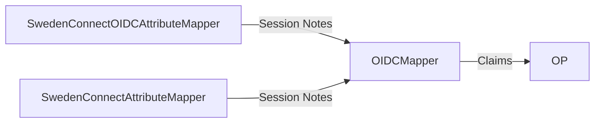
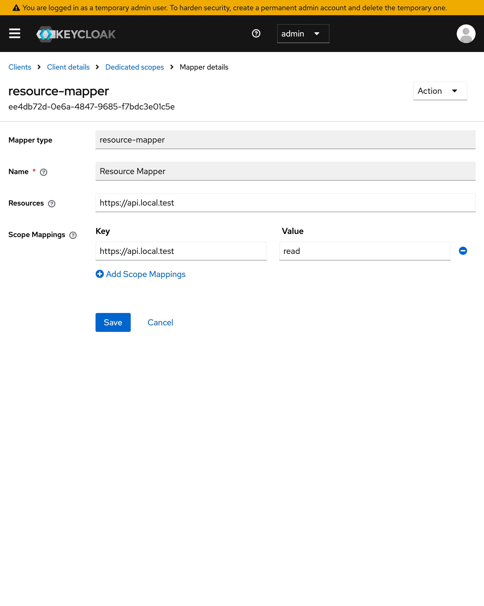

# Sweden Connect Provider

This module contains plugins for handling identity providers for Keycloak.

## SwedenConnectAttributeMapper
The SwedenConnectAttributeMapper reads SAML attributes from an incoming SAML assertion and saves it as a session note.

### Metadata

Configuring the SwedenConnectAttributeMapper for a SAML-IDP in keycloak will require you to fill in additional information required for use in Sweden 
Connect Federation. When this information your SAML metadata will be extended. So it's wise to configure this plugin before publishing your metadata. 

### Config

## Proxy Internals

SwedenConnectAttributeMapper (SAML) and SwedenConnectOIDCAttributeMapper (OIDC) maps attributes and claims to session notes using the same key so that the 
OIDCMapper can be used on the client side for either SAML or OIDC. 

## Resource Parameter
Support for RFC8707 is implemented by the ResourceAuthenticator and ResourceMapper.
The ResourceAuthenticator will check if a ResourceMapper is configured for the client during the auth request and check if the client is allowed to use the 
requested resource. If the authentication is successful the client will gain the requested aud claim mapped to their access token.

### Downscope
The resource mapper also supports downscoping.
This can be configured by setting what scopes are allowed for a given resource.

E.g.
The client requests the resources https://api1.test and https://api2.test.
The client also requests the scopes read and write.
This client is allowed to get read and write for https://api1.test but only read for https://api2.test.
The resulting authentication will contain both https://api1.test and https://api2.test in the audience claim but only gain the read scope.

If the client wants to gain the write scope for https://api1.test it must be done in a separate request where https://api2.test is excluded from the 
resource request.

### Config

### Key Providers

To simplify use of proxy realms with SAML the following utility key providers has been implemented.
- shareable-ec-key
- shareable-rsa-key
- shareable-rsa-enc-key
- shared-ec-key
- shared-rsa-key
- shared-rsa-enc-key

The `sherable` keys are keys that can be distributed between realms.
They have a configuration property to allow which realms can access them.

The `shared` keys are references to `shareable` keys and have properties for what realm and name to load.
Keys will only be loaded if allowed by the `shareable` instance.