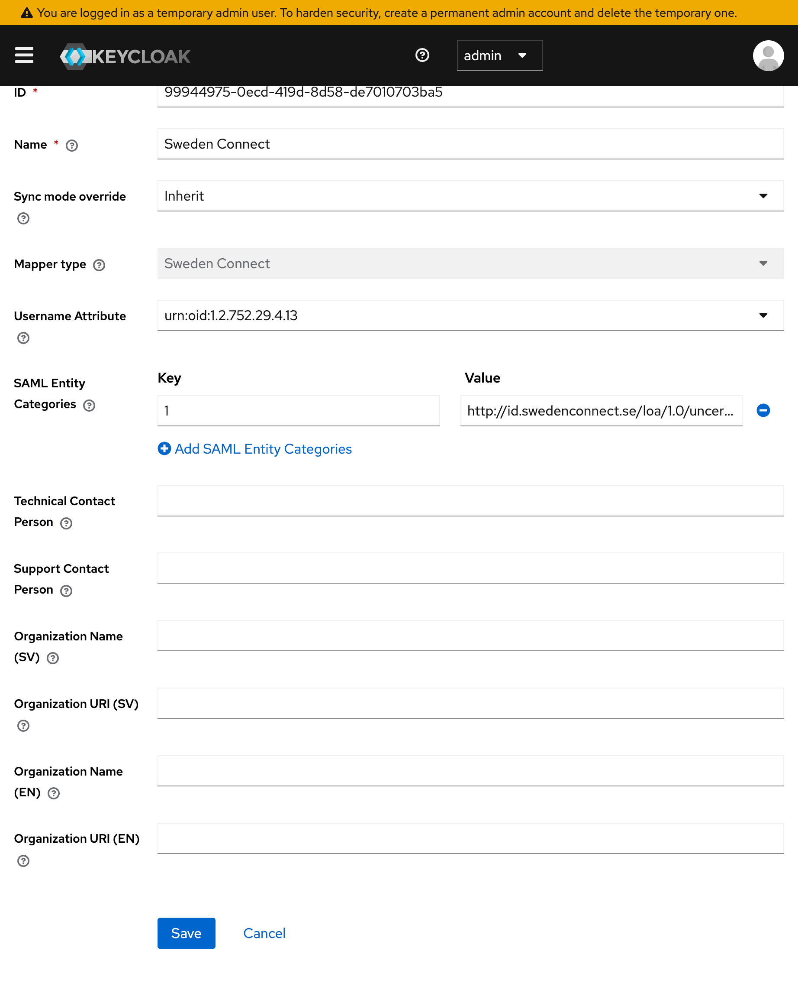
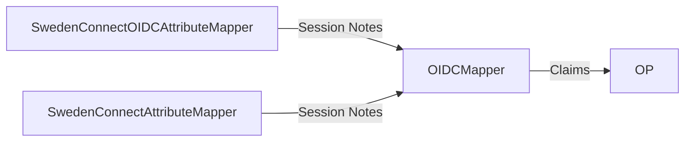

# Sweden Connect Provider

This module contains plugins for handling identity providers for Keycloak.

## SwedenConnectAttributeMapper
The SwedenConnectAttributeMapper reads SAML attributes from an incoming SAML assertion and saves it as a session note.

### Metadata

Configuring the SwedenConnectAttributeMapper for a SAML-IDP in keycloak will require you to fill in additional information required for use in Sweden 
Connect Federation. When this information your SAML metadata will be extended. So it's wise to configure this plugin before publishing your metadata. 

### Config

## Proxy Internals

SwedenConnectAttributeMapper (SAML) and SwedenConnectOIDCAttributeMapper (OIDC) maps attributes and claims to session notes using the same key so that the 
OIDCMapper can be used on the client side for either SAML or OIDC. 

```mermaid
    graph LR;
    SwedenConnectOIDCAttributeMapper & SwedenConnectAttributeMapper -->|Session Notes| OIDCMapper -->|Claims| OP
```

## Resource Parameter (RFC 8707)

Full configuration guide: [rfc8707-resource-indicators.md](rfc8707-resource-indicators.md)

Support for RFC 8707 resource indicators is implemented across three components:
`resource-authenticator` (auth flow), `resource-mapper` (protocol mapper), and
`rfc8707-resource-indicator` (client policy executor). All three must be configured together.

### Key Providers

To simplify use of proxy realms with SAML the following utility key providers has been implemented.
- shareable-ec-key
- shareable-rsa-key
- shareable-rsa-enc-key
- shared-ec-key
- shared-rsa-key
- shared-rsa-enc-key

The `sherable` keys are keys that can be distributed between realms.
They have a configuration property to allow which realms can access them.

The `shared` keys are references to `shareable` keys and have properties for what realm and name to load.
Keys will only be loaded if allowed by the `shareable` instance.