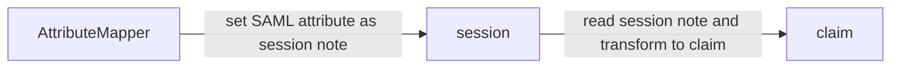

# Tekniskt Ramverk provider

## SAML to OIDC Attribute Translation

When SAML Attributes are presented to the AttributeMapper it will blindly put all of them into a session note.
It is then up to the OIDCMapper to read what attributes it is interested in and map these to oidc claims.
This way the AttributeMapper knows nothing about OIDC but the OIDCMapper knows about SAML Attribute names which brings us flexibility when configuring clients.

E.g. if the client is not interested in `urn:oid:1.2.752.201.3.13 (Authentication server signature` ) it does not translate this attribute and thus is not 
mapped to any token or endpoint.

